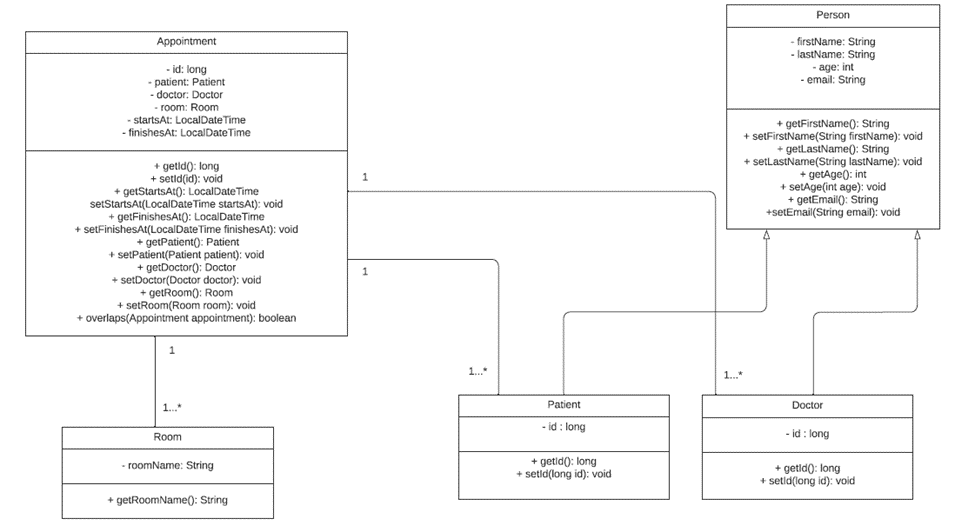

# accenture-techhub

## Run Locally

Clone the project

```bash
  git clone https://github.com/nuwe-reports/655e07fa7c9aa656e9c67869.git
```

Go to the project directory

```bash
  cd 655e07fa7c9aa656e9c67869
```

Install dependencies and build

```bash
  mvn install
```


## Tech Stack
Java 1.8, Docker 24.0.6, MySQL 5.7

# UML diagram


